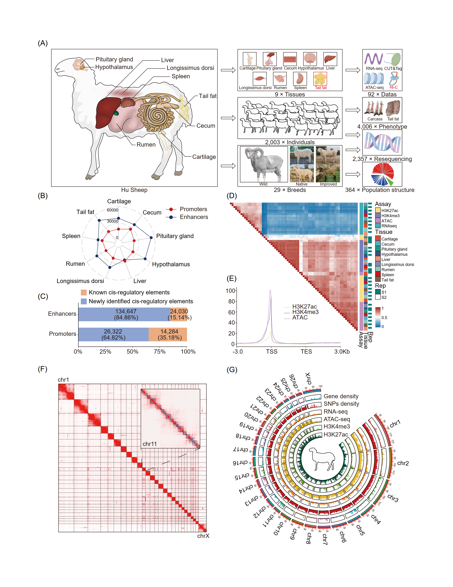

# **Comprehensive multi-tissue epigenome atlas in *Ovis aries*:** **A resource for sheep** **complex traits, domestication and breeding**

Deyin Zhang1#, Jiangbo Cheng1#, Xiaolong Li1#, Kai Huang1, Lvfeng Yuan9, Yuan Zhao1, Dan Xu2, Yukun Zhang1, Liming Zhao1, Xiaobin Yang2, Zongwu Ma2, Quanzhong Xu1, Chong Li2, Xiaojuan Wang2, Chen Zheng2, Defu Tang2, Fang Nian8, Xiangpeng Yue1, Wanhong Li1, Huibin Tian1, Xiuxiu Weng1, Peng Hu7, Yuanqing Feng6, [Peter Kalds](https://pubmed.ncbi.nlm.nih.gov/?term=Kalds+P&cauthor_id=36862946)5, Zhihua Jiang4, Yunxia Zhao3, Xiaoxue Zhang2, Fadi Li1 and Weimin Wang1*

# Summary

Comprehensive functional genome annotation is crucial to elucidate the molecular mechanisms of agronomic traits in livestock, yet systematic functional annotation of the sheep genome is lacking. Here, we generated 92 transcriptomic and epigenomic datasets from nine major tissues, along with whole-genome data from 2357 individuals across 29 breeds worldwide, and 4006 phenotypic data related to tail fat weight. We constructed the first multi-tissue epigenome atlas in terms of functional elements, chromatin states and their functions, and explored the utility of the functional elements in interpreting phenotypic variation during sheep domestication and improvement. Particularly, we identified a total of 753,723 non-redundant functional elements, with over 60% being novel. We found tissue-specific promoters and enhancers related to sensory abilities and immune response that were highly enriched in genomic regions influenced by domestication, while *longissimus dorsi* tissue-specific active enhancers and tail fat tissue-specific active promoters were highly enriched in genomic regions influenced by breeding and improvement. Notably, a variant, Chr13:51760995A > C, located in an enhancer region, was identified as a causal variant for tail fat deposition based on multi-layered datasets. Overall, this research provides foundational resources and a successful case for future investigations of complex traits in sheep through the integration of multi-omics datasets.

# Main work

# Code

- Codes for plotting figures can be found [here](https://github.com/wulabupenn/Figures_Joint-snhmC-seq_2023).

# Reference

**Comprehensive multi-tissue epigenome atlas in *Ovis aries*:** **A resource for sheep** **complex traits, domestication and breeding**

# Contact

Xiaolong Li(lixllil@163.com)